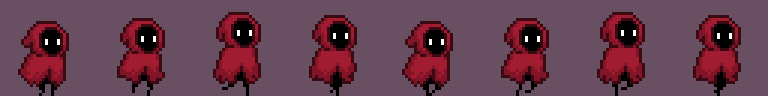
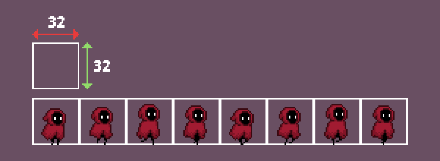
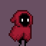

# AniRuby

  


Make sprite animations on Gosu, simply and easily.

## Summary

This library will provide you with a nice n easy interface to do sprite animations
on [Gosu](https://www.libgosu.org/), while being as nifty and simple as possible.

The library is made in pure Ruby with no dependencies at all (except Gosu, of course) so
it's quite lightweight.

## Install

You can install the gem with the following command:

```console
gem install aniruby
```

or use it with a bundle:

```ruby
# Somewhere in your Gemfile

gem 'aniruby'
```

## Getting Started

The smallest example:

```ruby

require 'gosu'
require 'aniruby'

class MyWindow < Gosu::Window
  def initialize
    super(800, 600, false)

    @animation = AniRuby::Animation.new('my_spritesheet.png', 32, 32,
                                        false, true,
                                        0.15)
  end

  def update
    # Remember to update your animation!
    @animation.update
  end

  def draw
    @animation.draw(0, 0)
  end
end
```

### Explanation

When you create a animation, you'll need to have an *spritesheet*, where you have
each sprite of the animation, that's the first argument to `Animation#new`, then
you'll need the dimensions of each individual sprite on your spritesheet, in the
example provided we assume each sprite in the spritesheet is 32x32. Take for example
the following spritesheet courtesy of penzilla on [Itch.io](https://penzilla.itch.io/hooded-protagonist)



when we load it, it'll be divided into different image based on the individual
dimensions of each sprite, so if we specify 32 as width and 32 as height then the
spritesheet will be divided like this:



That's the bare minimum to get an animation, of course you can enable Gosu's retro
option so pixel animations will still look crisp when scaled, enable looping or specify
the duration of the animation (or for every frame even!).

In the example above we initialize the animation with retro off, looping on and
with a duration of 0.15 (150ms) for every frame. So we'll get something like this:



Ain't that nice?

### Drawing

You can draw an animation like any other `Gosu::Image`! An animation has both
`Animation#draw` and `Animation#draw_rot`, these methods mimic the ones on Gosu, so you don't
have to learn anything new.

### Extras

Each `Animation` has extra helpful methods, like `pause` & `unpause`, `reset`,
`done?`, etc. I recommend you to look on the source, its pretty small and easy to
understand, or build the YARD documentation with:

```console
rake doc
```

## Development

### Setup

First clone this repo locally:

```console
git clone https://github.com/Chadowo/aniruby
```

Next you'll need to install the development dependencies of this gem with
`bundle install`, Then you can use `rake` to build or test the gem.

### Testing

[Minitest](https://github.com/minitest/minitest) is used to unit test this gem.
To run the tests just call `rake`.

## Roadmap

- more fine-grained control of animation
- being able to make an animation stitching `Gosu::Image`'s together
- mirroring
- inverse animation
- multiple animation from a single spritesheet

## License

This library is licensed under the [MIT](LICENSE) license.
